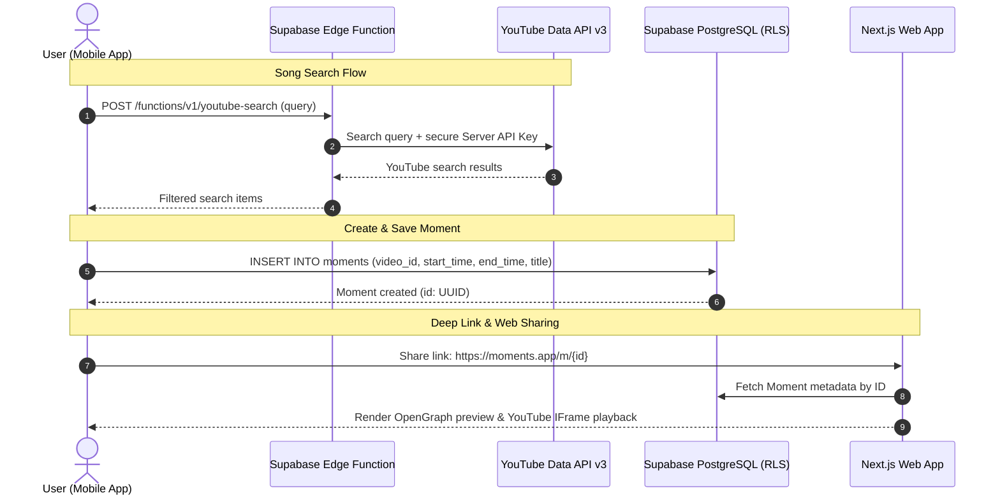

# Moments Architecture & System Design

Moments is a cross-platform mobile and web application that enables users to curate, organize, play, and share precise musical snippets ("Moments") from songs hosted on YouTube.

---

## 1. Architectural Philosophy & Core Principles

### Core Principle 1: Moments are Timestamped References, Never Media Downloads
> **A Moment is strictly a lightweight metadata reference:**
> `(videoId, startSeconds, endSeconds, title, artist, ...)`
> 
> Moments **never** downloads, extracts, strips, converts, stores, or re-hosts YouTube audio or video files. All media playback occurs directly inside official YouTube IFrame players, strictly respecting copyright, content licensing, and YouTube's Terms of Service.

### Core Principle 2: Zero Client-Side Secret Exposure
> **The YouTube Data API v3 key never ships inside the mobile client or frontend bundle.**
> 
> All YouTube queries, searches, and metadata lookups are proxied through an authenticated **Supabase Edge Function** (`supabase/functions/youtube-search`). The mobile app calls this Edge Function using its Supabase user session. The API key is securely stored in Supabase Secrets.

---

## 2. Tech Stack Overview

```
+-----------------------------------------------------------------------------------+
|                                  MOMENTS MONOREPO                                 |
+-----------------------------------------+-----------------------------------------+
|                MOBILE                   |                   WEB                   |
|  Flutter (Dart) • Material 3            |  Next.js (App Router, TypeScript)       |
|  State: Riverpod (Generators & Lint)    |  Deployment: Vercel                     |
|  Navigation: go_router                  |  Purpose: Landing + /m/[id] & /g/[id]   |
|  Player: YouTube IFrame Player (Visual) |           share previews                |
+-----------------------------------------+-----------------------------------------+
                                     |
                                     v
+-----------------------------------------------------------------------------------+
|                              BACKEND & DATA LAYER                                 |
|                       Supabase (Managed PostgreSQL 15)                            |
|  - PostgreSQL Database with Row Level Security (RLS) policies                     |
|  - Supabase Auth (Email, OAuth, Session Tokens)                                   |
|  - Supabase Storage (Group covers, avatars)                                       |
|  - Supabase Edge Functions (Deno / TypeScript runtime)                            |
+-----------------------------------------------------------------------------------+
                                     |
                                     v
+-----------------------------------------------------------------------------------+
|                             EXTERNAL THIRD-PARTY APIs                             |
|  - YouTube Data API v3 (Queried ONLY via Supabase Edge Function)                   |
|  - PostHog (Product analytics, privacy-compliant event telemetry)                 |
+-----------------------------------------------------------------------------------+
```

---

## 3. High-Level Data Flow



---

## 4. Key Subsystems

### Mobile Client (`app/`)
- **Flutter & Material 3**: Provides high-performance 60/120 FPS native UI with modern Material Design tokens.
- **Riverpod Architecture**: State separation into functional feature slices (`data/`, `domain/`, `presentation/`).
- **go_router**: Declarative route hierarchy with deep linking support for `/m/:id` and `/g/:id`.
- **Playback**: Embedded visible `youtube_player_flutter` / webview controller ensuring player visibility at all times.

### Web Client (`web/`)
- **Next.js App Router**: Optimized for fast server-side rendering (SSR), high performance, and dynamic OpenGraph/meta tag generation for social sharing.
- **Dynamic Routes**:
  - `/m/[id]`: Preview and play individual timestamped Moments.
  - `/g/[id]`: Preview and sequentially play curated Groups of Moments.

### Supabase Backend (`supabase/`)
- **Row Level Security (RLS)**: Enforces zero-trust data access directly in Postgres. Users can only edit/delete their own moments, groups, and sessions.
- **Edge Functions**: Isolates external API keys and performs server-side validation.

---

## 5. Database Schema & Row-Level Security (RLS)

### Database Tables Summary
- **`profiles`**: Public user identity, handles, avatars, bios, and denormalized `moments_count` maintained via trigger.
- **`moments`**: Core snippet references with YouTube `video_id`, timestamp boundaries (`start_seconds`, `end_seconds`), metadata, and privacy flag (`is_public`).
- **`moment_groups`**: User-curated playlists and snippet collections with privacy controls (`is_public`).
- **`moment_group_items`**: Ordered join table linking moments into groups by `position` (omits strict `UNIQUE(group_id, position)` to facilitate smooth drag-and-drop batch reordering).
- **`likes`**: Social likes on Moments with composite uniqueness on `(user_id, moment_id)`.
- **`saves`**: Private personal bookmarks of other creators' Moments into a user's library.
- **`follows`**: Directed social follow graph edges between user profiles with self-follow prevention.

### Row-Level Security (RLS) Philosophy
Every table has Row-Level Security (`ENABLE ROW LEVEL SECURITY`) activated unconditionally:
- **Public vs. Private Split**: Rows with `is_public = true` are readable by anyone (including anonymous web previewers for deep link previews). Rows with `is_public = false` are strictly restricted to the owning creator (`auth.uid() = user_id`).
- **Zero-Trust Writes**: Only authenticated owners can `INSERT`, `UPDATE`, or `DELETE` their own entities. Profile inserts are strictly automated via `auth.users` trigger with `SECURITY DEFINER`.
- **Group Isolation**: `moment_group_items` inherit access rules dynamically through an `EXISTS` subquery verifying the parent `moment_groups` ownership or public visibility.
- **Private Bookmarks**: `saves` are strictly private to the user (`auth.uid() = user_id`), while `likes` and `follows` permit open reads for counters and social discovery.

